# ARCHITECTURE.md

# Arquitectura

Fecha: 2026-03-08

## Principios
- Clean Architecture: domain -> application -> infrastructure -> interfaces.
- Multi-tenant: tenantId obligatorio en cada consulta y comando.
- White-label: branding via CSS variables y configuracion por tenant.

## Backend (Node + Express)
- Domain: entidades y reglas (Tenants, Billing, POS, CRM, etc).
- Application: casos de uso y servicios (CreateInvoiceUseCase, TaxCalculatorService).
- Infrastructure: Mongo, InMemory, SSE hubs, terceros.
- Interfaces: rutas HTTP y middlewares.

## Frontend (React)
- shared: layouts, contextos, UI base, infraestructura HTTP.
- modules: features por rol y vertical (admin, staff, landing, hosteleria).

## Flujos clave
- Auth -> JWT -> tenantId en req.auth.
- VerticalRegistry -> rutas dinamicas de landing + temas.
- POS -> venta -> billing (invoice) si status PAGADA.
- Orders -> SSE -> KitchenDisplay.

## Diagramas

### Capas Clean Architecture
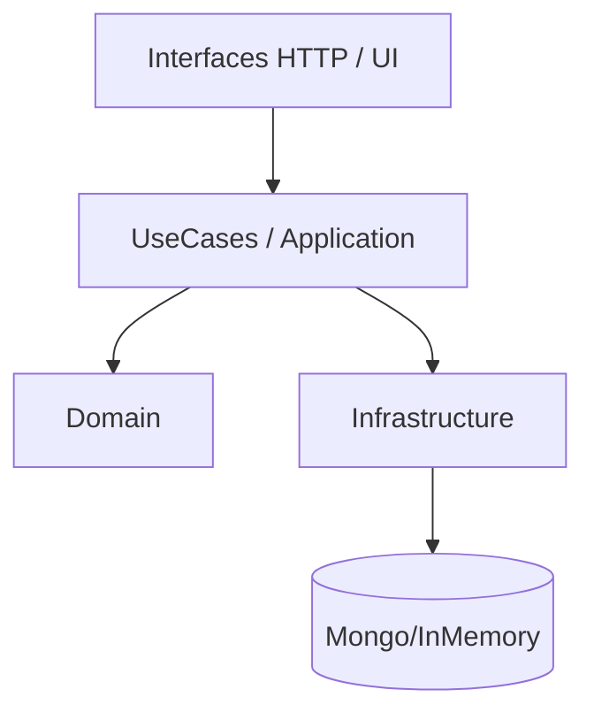

### Flujo POS -> Billing
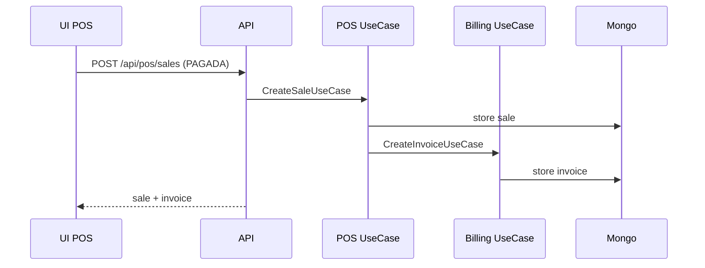

### Orders SSE
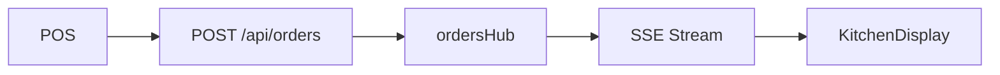

---

# BILLING.md

# Billing e impuestos

Fecha: 2026-03-08

## Objetivo
Generar facturas con impuestos segun pais del tenant.

## Entidad
Invoice: subtotal, taxAmount, total, currency, tenantId, country.

## Flujo
- POS crea venta con paymentStatus = PAGADA.
- POS llama CreateInvoiceUseCase.
- TaxCalculatorService aplica tasa por pais.

## Endpoints
- POST /api/billing/invoices (manual)
- POST /api/pos/sales (auto si PAGADA)

## Tenant country
- Campo country en Tenant.
- Default CO si no existe.

## Ejemplo
```bash
curl -X POST http://localhost:4000/api/billing/invoices \
	-H "Authorization: Bearer $TOKEN" \
	-H "Content-Type: application/json" \
	-d '{"subtotal":100000,"currency":"COP"}'
```

---

# CHANGELOG.md

# Changelog

## 2026-03-08
- Rutas dinamicas por vertical y pagina 404 con estilo Essence.
- Billing con facturas e impuestos por pais.
- ContentService para copy dinamico en landings.
- SSE de comandas y KitchenDisplay.
- ModuleGuard con upsell card.
- POS con soporte de ordenes a cocina y estado PAGADA.

---

# CONTENT.md

# Content Service (IA placeholder)

Fecha: 2026-03-08

## Objetivo
Generar copy dinamico por vertical sin lorem ipsum.

## Endpoint
- GET /api/content/landing/:verticalId

## Frontend
- DynamicHero consume este endpoint para hero de la landing.

## Ejemplo
```bash
curl http://localhost:4000/api/content/landing/restaurantes
```

---

# DEPLOYMENT.md

# Deploy y configuracion

Fecha: 2026-03-08

## Entorno
- Node >= 18
- MongoDB + Redis (opcional)

## Variables clave
Backend:
- JWT_SECRET
- MONGODB_URI
- USE_MONGO
- REDIS_URL
- ENABLE_JOBS
- MP_* (Mercado Pago)

Frontend:
- VITE_API_BASE_URL

## Notas
- SSE requiere proxy que no bufferice (X-Accel-Buffering: no).
- Service Worker basico en frontend/public/basic-sw.js.

## Checklist de despliegue
- Definir JWT_SECRET seguro.
- Configurar MP_* si se usa Mercado Pago.
- Revisar CORS_ORIGINS para dominios finales.
- Habilitar HTTPS para SSE estable.
- Monitorear logs pino-http.

---

# FACTORY_SAAS.md

# ESSENCE FACTORY SAAS - Documentacion Tecnica para Desarrollo

Fecha: 2026-03-05

## 0. Documentacion extendida
- docs/INDEX.md
- docs/ARCHITECTURE.md
- docs/FEATURES.md
- docs/VERTICALS.md
- docs/REALTIME.md
- docs/BILLING.md
- docs/CONTENT.md
- docs/DEPLOYMENT.md

## 1. Resumen Ejecutivo
Essence Factory SaaS es una plataforma multi-tenant white-label para verticales de servicios. El sistema opera como monorepo con frontend React (SPA) y backend Node/Express, con persistencia en MongoDB y jobs opcionales via Redis/BullMQ. La plataforma ofrece onboarding automatico de negocios, control por planes, branding por tenant y modulos de operacion (agenda, staff, inventario, reportes, WhatsApp).

## 2. Como empezar (dev)

### 2.1 Requisitos
- Node.js >= 18
- Docker Desktop (para Mongo/Redis)
- Git

### 2.2 Configuracion rapida
1) Copia el archivo de entorno:
	- `cp .env.example .env`
2) Define un `JWT_SECRET` seguro (64 bytes hex).
3) Instala dependencias:
	- `npm install`
4) Ejecuta el entorno de desarrollo:
	- `npm run dev`

### 2.3 Alternativa sin Docker
Si no puedes usar Docker, ejecuta:
- `npm run dev:backend:memory`
- `npm run dev:frontend`

### 2.4 Puertos por defecto
- Frontend: http://localhost:5174
- Backend API: http://localhost:4000
- MongoDB: 27017
- Redis: 6379
- Mongo Express: http://localhost:8081

### 2.5 Troubleshooting rapido
- Error `JWT_SECRET es obligatorio`: crea `.env` en la raiz y define `JWT_SECRET`.
- Error Docker pipe (Windows): inicia Docker Desktop.
- Orphan containers: `docker compose up -d --remove-orphans`.

## 3. Arquitectura General

### 3.1 Topologia
- Frontend SPA: React 19 + Vite 6 + Tailwind 4 + React Router 7.
- Backend API REST: Node.js + Express + TypeScript.
- Persistencia: MongoDB (principal) con repositorios in-memory para fallback.
- Jobs: Redis + BullMQ (opcional, controlado por ENABLE_JOBS).
- Hosting: Nginx (en Docker), configuracion local con Vite.

### 3.2 Multi-Tenancy
- `tenantId` viaja en JWT y condiciona consultas.
- Repositorios filtran por `tenantId` en la capa de persistence.
- Frontend resuelve tenant por subdominio y aplica branding con CSS variables.

### 3.3 Capas de Aplicacion
Backend sigue arquitectura hexagonal:
- domain: entidades, reglas y validaciones core.
- application: casos de uso.
- infrastructure: adaptadores (Mongo, Redis, JWT, etc).
- interfaces: rutas HTTP y controladores.

Frontend sigue separacion por modulos:
- shared: contextos, layouts, infraestructura y UI base.
- modules: features por rol (admin, staff, god, landing, onboarding).

### 3.4 Diagramas (arquitectura y flujos)

#### 3.4.1 Flujo general (frontend + backend + datos)
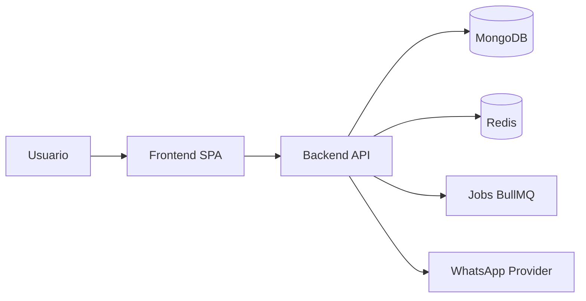

#### 3.4.2 Flujo de autenticacion
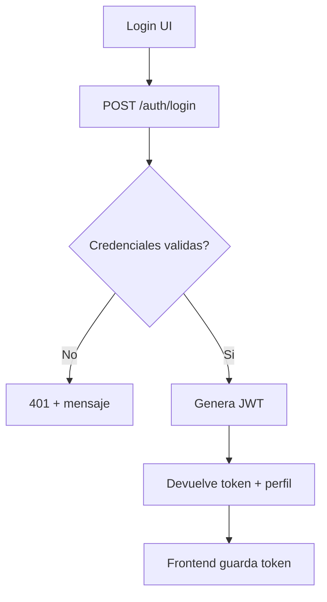

#### 3.4.3 Flujo multi-tenant (request)
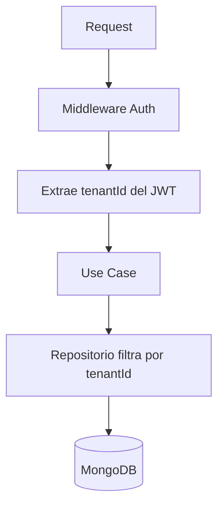

#### 3.4.4 Provisioning de tenant
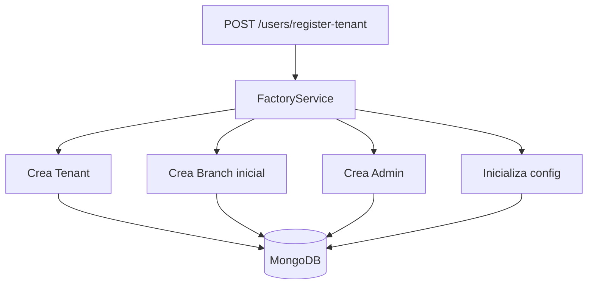

## 4. Rutas y Hosts

### 4.1 Namespace por host
- domain.com/ -> Landing principal (corporativa, venta del producto).
- domain.com/barberias-landing -> Landing vertical barberias (marketing + planes + login).
- subdominio.domain.com/ -> Software real del cliente (tenant).

### 4.2 Router por contexto
- landing: rutas publicas de marketing y vertical.
- app: rutas internas para roles y paneles.
- tenant: ruta de booking para clientes finales.

## 5. Roles y Jerarquia
- GOD: control global (tenants, planes, metricas, panel GOD).
- ADMIN: operacion del tenant (agenda, staff, inventario, reportes, sedes).
- BARBER: operacion diaria (staff dashboard).
- CLIENT: reserva y acceso al booking.

## 6. Backend

### 6.1 Stack
- Node.js >= 18
- Express 4
- TypeScript
- MongoDB + Mongoose
- Redis + BullMQ (opcional)
- JWT + bcrypt

### 6.2 Modulos
- auth: login, tokens, reset de password.
- users: CRUD de usuarios, registro de cliente, registro de tenant.
- tenants: data del negocio, branding, metrics.
- plans: planes globales y limites.
- branches: sedes por tenant.
- services: catalogo de servicios.
- barbers: horarios y bloqueos.
- appointments: reservas, cambios y reglas de colision.
- notifications: WhatsApp, logs y configuracion.
- reports: resumen diario, rango y comisiones.
- inventory: productos, ventas, reabastecimiento.

### 6.3 Entidades principales
- Plan: name, price, maxBranches, maxBarbers, maxMonthlyAppointments, features.
- Tenant: name, slug, subdomain, planId, status, customColors, logoUrl, config.
- Branch: tenantId, name, address, phone, active.
- User: role, tenantId, branchIds, approved, whatsappConsent, commissionRate.
- Appointment: tenantId, branchId, clientId, barberId, serviceId, startAt, endAt, status.
- Product: tenantId, name, sku, price, stock, costos y restocks.
- WhatsAppLog: tenantId, event, roleTarget, phone, status.

### 6.4 Relaciones de Base de Datos
- Plan 1..n Tenant (Tenant.planId).
- Tenant 1..n Branch (Branch.tenantId).
- Tenant 1..n User (User.tenantId).
- Tenant 1..n Service (Service.tenantId).
- Tenant 1..n Product (Product.tenantId).
- Tenant 1..n Appointment (Appointment.tenantId).
- Tenant 1..n WhatsAppLog (WhatsAppLog.tenantId).
- Branch 1..n Appointment (Appointment.branchId).
- User (BARBER) 1..n Appointment (Appointment.barberId).
- User (CLIENT) 1..n Appointment (Appointment.clientId).
- Service 1..n Appointment (Appointment.serviceId).
- User n..n Branch (User.branchIds).

### 6.4.1 Diagrama de entidades (ER)
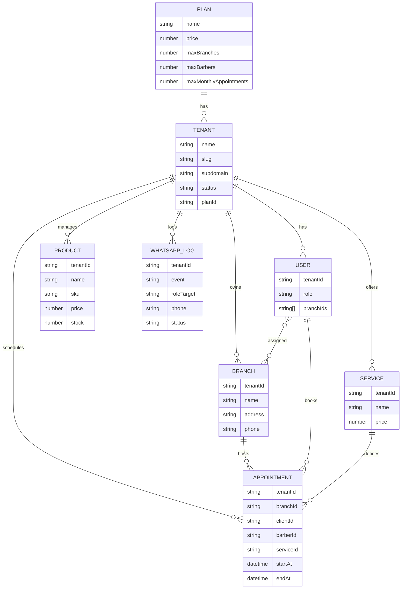

### 6.5 Provisioning (FactoryService)
Registro tenant:
1) Crea Tenant con plan Trial por defecto.
2) Crea Branch inicial.
3) Crea Admin asociado.
4) Inicializa config de agenda y notificaciones.

### 6.6 Gatekeeper de Planes
Middleware para controlar limites por plan:
- Antes de crear BARBER -> valida maxBarbers.
- Antes de crear BRANCH -> valida maxBranches.

### 6.7 No-shows
- Regla: bloqueo o pago previo despues de N faltas.
- Respuesta 402 con `paymentUrl` para desbloqueo.

### 6.8 Redis y Jobs
- ENABLE_JOBS controla ejecucion de jobs.
- Redis en 6379 por default.
- En dev, si Redis no esta activo, logs pueden aparecer pero no bloquean el API.

## 7. Frontend

### 7.1 Stack
- React 19
- TypeScript
- Vite 6
- Tailwind 4
- React Router 7
- TanStack Query
- Recharts
- React Day Picker

### 7.2 White-Label
- TenantContext resuelve el subdominio.
- Inyecta CSS variables: --primary, --secondary, --logo-url.
- Branding dinamico en layouts y componentes base.

### 7.3 Rutas Principales
Landing:
- / -> landing corporativa.
- /barberias-landing -> vertical barberias.
- /barberias-login -> login duenos y staff.
- /barberias-client-login -> login clientes (con subdominio).
- /admin-login -> login exclusivo GOD.

App:
- /admin
- /admin/agenda
- /admin/team (comisiones)
- /admin/branches
- /admin/whatsapp
- /admin/inventory
- /admin/reports
- /staff
- /god

Tenant:
- / -> booking engine

### 7.4 Login y Roles
- LoginCard valida roles permitidos segun portal.
- GOD solo entra via /admin-login.
- Duenos y staff via /barberias-login.
- Clientes via /barberias-client-login + subdominio.

### 7.5 PWA
- Vite PWA con manifest e iconos personalizados.
- Registro de SW en prod con wrapper para dev.

### 7.6 Flujos UI clave

#### 7.6.1 Login por portal y rol
```mermaid
flowchart TD
	A[Selecciona portal] --> B{Portal}
	B -- Admin/GOD --> C[/admin-login]
	B -- Duenos/Staff --> D[/barberias-login]
	B -- Clientes --> E[/barberias-client-login]
	C --> F[LoginCard valida roles]
	D --> F
	E --> F
	F --> G[AppLayout]
```

#### 7.6.2 Booking publico
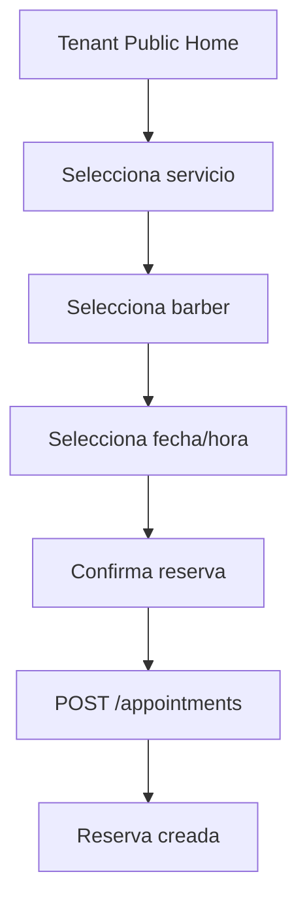

## 8. API REST (Resumen)

### Auth
- POST /auth/login
- GET /auth/me
- POST /auth/password/forgot
- POST /auth/password/reset

### Users
- GET /users (ADMIN)
- POST /users/register
- POST /users/register-tenant
- POST /users/admin (ADMIN)
- GET /users/pending (GOD)
- PATCH /users/:id
- PATCH /users/:id/whatsapp-consent
- PATCH /users/me
- GET /users/public/barbers

### Tenants (GOD)
- GET /tenants
- GET /tenants/metrics
- GET /tenants/usage/whatsapp
- GET /tenants/slug/:slug
- GET /tenants/:id

### Plans (GOD)
- GET /plans
- PATCH /plans/:id

### Branches
- GET /branches (ADMIN)
- POST /branches (ADMIN)

### Services
- GET /services
- POST /services (ADMIN)
- PATCH /services/:id (ADMIN)

### Barbers
- GET /barbers/:barberId/schedules
- POST /barbers/:barberId/schedules
- GET /barbers/:barberId/blocks
- POST /barbers/:barberId/blocks

### Appointments
- GET /appointments
- POST /appointments
- PATCH /appointments/:id/status
- POST /appointments/:id/cancel
- POST /appointments/:id/reschedule
- POST /appointments/:id/reassign
- GET /appointments/:id/history

### Notifications
- GET /notifications/logs
- GET /notifications/config
- PATCH /notifications/config

### Reports
- GET /reports/summary
- GET /reports/daily
- GET /reports/range

### Inventory
- GET /inventory
- POST /inventory
- PATCH /inventory/:id
- DELETE /inventory/:id
- POST /inventory/sales
- POST /inventory/restock

## 9. Variables de Entorno

### 9.1 Backend
- NODE_ENV, PORT
- MONGODB_URI, USE_MONGO
- REDIS_URL, ENABLE_JOBS
- JWT_SECRET, JWT_EXPIRES_IN
- MIN_ADVANCE_MINUTES, CANCEL_LIMIT_MINUTES, RESCHEDULE_LIMIT_MINUTES
- QUIET_HOURS_START, QUIET_HOURS_END
- CORS_ORIGINS
- CLOUDINARY_*
- VAPID_*

### 9.2 Frontend
- VITE_API_BASE_URL

## 10. Build y Dev

### 10.1 Comandos
- npm run dev (monorepo)
- npm run dev -w backend
- npm run dev -w frontend
- npm run build

### 10.2 Notas de Dev
- Vite usa polling en Windows para detectar cambios.
- Backend usa ts-node-dev con polling.
- Redis puede ser opcional en dev.

### 10.3 Flujos operativos (dev)

#### 10.3.1 Boot de entorno (Docker)
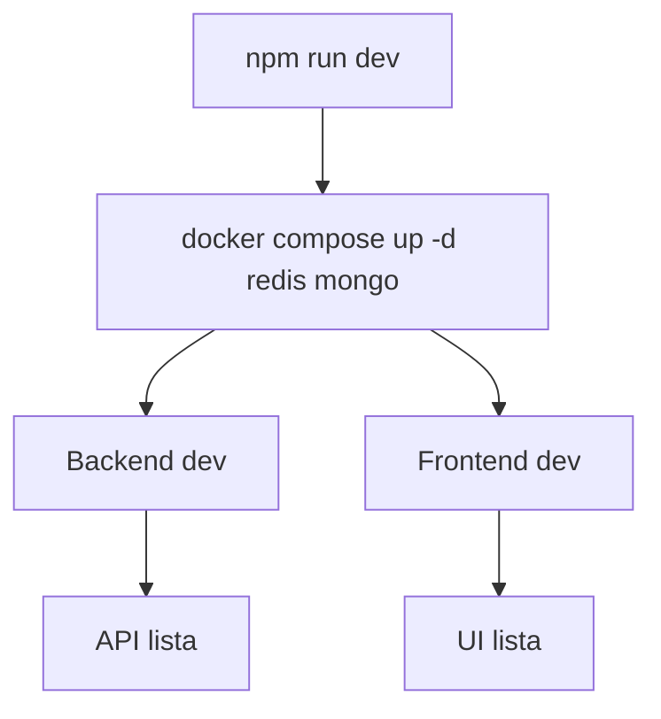

#### 10.3.2 Boot sin Docker
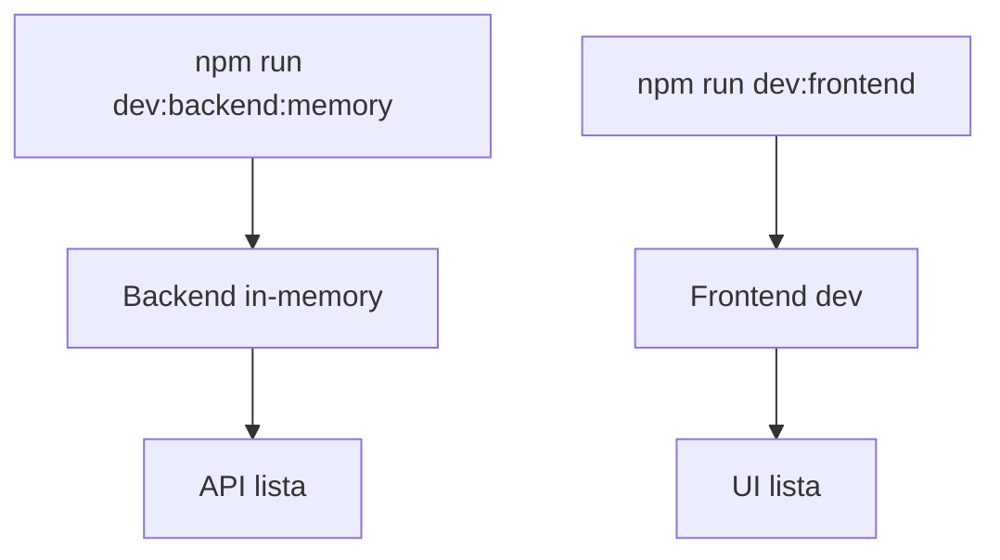

## 11. Seguridad
- JWT con expiracion configurada.
- bcrypt para hashing de password.
- CORS configurado por env.
- Rate limiting activo.

## 12. Observabilidad
- pino-http para logs.
- Swagger base habilitado en /docs.

## 13. Roadmap Tecnico
- Landing SEO por vertical con metadatos dinamicos.
- Dashboard GOD con graficas y uso por ciudad.
- Multi-vertical extensible (restaurantes, gimnasios).

---

# FEATURES.md

# Funcionalidades

Fecha: 2026-03-08

## Core
- Auth + RBAC
- Tenants + branding
- CRM
- Notifications
- Plans
- Reports
- Payments (Mercado Pago)
- Billing (Invoices + impuestos por pais)

## Hospitality (Hosteleria)
- Mesas (tables) + mapa
- POS + ventas
- Kitchen Display (SSE)
- Menu digital (placeholder)

## Legal y compliance
- Consentimiento PTD, Terms, DPA, Cookies, SaaS Agreement.
- ARCO export/delete.

## UI y experiencia
- GSAP para transiciones de ruta y animaciones.
- DynamicBackground + identidad por vertical.
- ModuleGuard con upsell cuando no hay modulo activo.

## Ejemplos rapidos (API)

### POS (venta pagada)
```bash
curl -X POST http://localhost:4000/api/pos/sales \
	-H "Authorization: Bearer $TOKEN" \
	-H "Content-Type: application/json" \
	-d '{"items":[{"productId":"p1","name":"Cafe","quantity":1,"price":12}],"paymentMethod":"cash","paymentStatus":"PAGADA","currency":"COP"}'
```

### Orders (cocina)
```bash
curl -X POST http://localhost:4000/api/orders \
	-H "Authorization: Bearer $TOKEN" \
	-H "Content-Type: application/json" \
	-d '{"tableLabel":"Mesa 7","items":[{"name":"Hamburguesa","quantity":2}]}'
```

---

# INDEX.md

# ESSENCE Factory - Documentacion Extendida

Fecha: 2026-03-08

Este indice agrupa la documentacion tecnica y funcional creada para el equipo.

## Indice
- ARCHITECTURE.md: arquitectura, capas y contratos principales.
- FEATURES.md: funcionalidades por dominio y UI.
- VERTICALS.md: modelo de verticales y rutas dinamicas.
- REALTIME.md: SSE, Kitchen Display y eventos.
- BILLING.md: facturacion e impuestos por pais.
- CONTENT.md: generador de contenido por vertical.
- DEPLOYMENT.md: despliegue y variables clave.
- ONBOARDING.md: guia de entrada para nuevos devs.
- CHANGELOG.md: resumen de cambios por fecha.

---

# Lo que quiero para la factory.md

📄 Documento de Requerimientos de Producto (PRD) - ESSENCE Software Factory
🎯 1. Objetivo del Proyecto
Desarrollar una plataforma SaaS Multi-Tenant escalable que ofrezca soluciones de software especializadas para múltiples sectores comerciales (verticales). El núcleo de la propuesta de valor es el White-Labeling Dinámico: cada cliente (Tenant) debe percibir y operar el sistema como si fuera un software hecho a la medida, con su propia identidad visual y marca. El sistema debe garantizar altos estándares de estética (Nitidez Essence), velocidad y seguridad estructural.

💰 Modelo de Monetización (Tarifa Universal)
Todos los servicios operarán bajo un modelo de suscripción estándar SaaS:

Plan Mensual: $50.000 COP / mes.

Plan Anual: $500.000 COP / año (Ahorro de 2 meses).

🏗️ 2. Componentes Principales de la Arquitectura
Módulo A: Portal Central de la Factory (B2B Core)
Punto de entrada principal para conocer a ESSENCE como empresa matriz.

Sección Institucional: Información de "Quiénes Somos" y la misión de la Factory.

Vitrina de Verticales: Sección destacada con algunos servicios clave (ej. Barberías, Abogados, Restaurantes) y un botón de "Ver todos los servicios" que redirija a un catálogo completo.

Acceso Administrativo: Login exclusivo y oculto para el equipo interno de administradores (Super Admins de ESSENCE).

Internacionalización (i18n): Selector global de idiomas para traducir toda la plataforma.

Módulo B: Landings Dinámicas por Servicio (Industry Verticals)
Páginas de ventas específicas para cada nicho de mercado.

Diseño Dinámico por Nicho: Cada landing debe tener colores, tipografías y distribución de componentes acordes a su sector (Ej. Barberías: rojo, blanco y negro; Salud: azules limpios y blancos).

Contenido Específico: Módulos que ofrece ese servicio en particular, características, capacidades técnicas y beneficios del sector.

Selector de Idioma Local: Capacidad de cambiar el idioma de la landing actual.

Portal de Acceso (Login): Acceso dedicado para que los Tenants que ya contrataron ese servicio específico puedan entrar a su panel de control.

Módulo C: Motor de Suscripción y Onboarding
El embudo de conversión y recolección de datos del cliente.

Pasarela de Pago: Checkout transparente para procesar los $50.000 COP (Mensual) o $500.000 COP (Anual).

Wizard de Onboarding (Setup de Empresa): Un formulario paso a paso donde el Tenant configura su negocio recién creado:

Nombre de la empresa.

Logotipo corporativo.

Ubicación física (Dirección/Mapa).

Teléfonos de contacto.

Identidad visual (Selección de colores primarios de su marca).

Módulo D: Marca Blanca y Portal Público B2C (El Core del Tenant)
El producto final que el Tenant le entrega a sus propios clientes.

Landing Web Pública del Negocio: Una página web única y funcional generada automáticamente para el Tenant (Ej. essence.com/barberias/corte-fino).

Inyección Dinámica de Marca: La landing pública debe usar el logotipo y los colores hexadecimales configurados en el Onboarding, asegurando que el cliente final solo vea la marca del Tenant y no la de ESSENCE.

Información de Contacto: Visualización clara de la dirección, teléfono, mapa y descripción del negocio.

📅 Módulo E: Motor de Reservas Inteligente y Gestión Operativa (Booking & Staff Engine)
Este módulo es el corazón transaccional para verticales basadas en servicios (Barberías, Spa, Consultorios, etc.). Permite a los clientes finales (B2C) autogestionar sus citas bajo un conjunto estricto de reglas de negocio definidas por el Tenant (B2B).

E.1. Flujo de Agendamiento B2C (Experiencia del Cliente Final)
Selección Parametrizada: El cliente selecciona Fecha, Hora y el Servicio específico que desea (Ej. "Corte + Barba - $25.000 COP").

Filtro Inteligente de Profesionales (Skill-based Routing): El sistema debe cruzar el servicio seleccionado con las habilidades de los empleados. En la lista de selección, solo aparecerán los profesionales capacitados y disponibles en ese horario.

Captura de Leads: Formulario final para confirmar la reserva solicitando: Nombre, Correo Electrónico y Teléfono (WhatsApp).

E.2. Sistema Omnicanal de Notificaciones (White-Label Communications)
Identidad de Envío Remitente: Todas las comunicaciones saldrán utilizando el correo y número de teléfono que el Tenant configuró en el Onboarding. (Nota de UX: Añadir un "Disclaimer" obligatorio en el Onboarding advirtiendo al Tenant sobre el uso de sus datos para este fin).

Cronograma de Disparos Automáticos:

Inmediato: Confirmación de reserva (Email y WhatsApp/SMS).

Día de la cita: Recordatorio en cascada faltando 1 hora, 30 minutos y 5 minutos.

Post-cita: Notificación de inasistencia (No-show) si el cliente no se presenta.

E.3. Motor de Reputación y Fidelización (Customer Trust System)
Puntaje Base: Todo cliente nuevo inicia con un saldo de 100 Puntos de Confianza.

Penalización (No-Show): Si el cliente reserva y no asiste, el sistema deduce automáticamente 10 puntos.

Bloqueo (Blacklist Automática): Si el puntaje llega a 0, el sistema bloquea futuras reservas que coincidan con esa triada de datos (Nombre, Correo o Teléfono).

Recompensas (Loyalty): Asistir a la cita suma 10 puntos, los cuales el Tenant puede configur para canjear por recompensas o descuentos futuros.

E.4. Panel de Configuración B2B (Tenant Dashboard)
Gestión de Catálogo: Creación de servicios con nombre, duración y precio dinámico.

Gestión de Staff y Habilidades: Creación de perfiles de profesionales y asignación de "Servicios Permitidos" (Skills) a cada uno.

Motor de Nómina y Comisiones: Configuración del modelo de pago por profesional. El Tenant debe poder elegir si paga por:

Porcentaje (Ej. 50% del servicio).

Valor Fijo (Ej. $10.000 COP por corte).

Ninguno (Solo salario base externo).

Ajustes de Gamificación: Interfaz para que el Tenant active/desactive el sistema de puntos o modifique las reglas de penalización.

👥 Módulo F: Sistema de Empleados y Roles Operativos (RBAC & Staff Portal)
Este módulo dota al sistema de capacidades de operación multi-usuario dentro de un mismo Tenant. Permite al dueño del negocio (Admin) invitar a su equipo de trabajo, asignando permisos granulares basados en el rol físico que desempeñan en la empresa, garantizando seguridad y eficiencia operativa.

F.1. Portal de Acceso para Empleados (Staff Login)
Login Unificado: Los empleados acceden a través de la misma URL administrativa de su Tenant (Ej. essence.com/login), pero el sistema los enruta automáticamente a su "Espacio de Trabajo" (Workspace) dependiendo de su rol.

Autogestión de Perfil: El empleado puede actualizar su foto de perfil, su contraseña y ver sus métricas personales de rendimiento (si el rol lo permite).

F.2. Tipologías de Roles y Permisos Estrictos (Casos de Uso)
El sistema debe soportar una matriz de permisos. Los roles predeterminados por vertical incluyen:

1. Rol: Especialista / Agendado (Ej. Barbero, Médico, Estilista):

Vistas Permitidas: Calendario personal (Mi Agenda), historial de sus clientes atendidos, reporte de sus comisiones generadas en el día/mes.

Acciones: Puede bloquear espacios en su propia agenda (Ej. "Hora de almuerzo" o "Cita médica personal"), marcar citas como "Completadas" o "No Asistió" (No-show).

Restricciones: No puede ver la agenda de otros compañeros, no puede modificar precios de servicios, no tiene acceso a las finanzas globales del local.

2. Rol: Operativo de Sala / POS (Ej. Mesero, Cajero, Vendedor):

Vistas Permitidas: Mapa de Mesas, Terminal de Punto de Venta (POS), Catálogo de productos.

Acciones: Tomar pedidos, enviar comandas a cocina, cobrar cuentas.

Restricciones: No puede aplicar descuentos mayores al permitido, no puede anular facturas pagadas ni borrar órdenes enviadas sin el PIN de autorización del Administrador.

3. Rol: Operativo de Producción (Ej. Cocinero, Bodeguero):

Vistas Permitidas: Exclusivamente el Monitor de Producción (KDS - Kitchen Display System) o Monitor de Despachos.

Acciones: Cambiar el estado de los tickets ("En preparación" -> "Listo para entregar").

Restricciones: Cero acceso a precios, clientes, agendas o facturación. Interfaz 100% enfocada en la producción.

F.3. Control Administrativo (Tenant Owner)
Gestión de Invitaciones: El dueño puede enviar invitaciones por correo o crear las credenciales directamente para su equipo.

Configuración de Horarios Laborales: El Admin define en qué días y horas trabaja cada especialista (Ej. "Carlos trabaja de Lunes a Viernes de 8am a 4pm"). Esto alimenta directamente la disponibilidad en la Landing Pública B2C.

Botón de Pánico (Kill Switch): Capacidad del dueño de suspender o revocar el acceso a un empleado instantáneamente en caso de despido o emergencia.

📊 Módulo G: Inteligencia de Negocio y Finanzas (BI Dashboard)
El dueño del negocio no solo quiere operar; quiere saber cuánto dinero está ganando. Este módulo es el cerebro financiero del Tenant.

Panel Principal (Dashboard B2B): Gráficos en tiempo real (con React y transiciones suaves) que muestren:

Ingresos brutos del día / semana / mes.

Tasa de inasistencia (No-shows vs. Citas completadas).

Ticket promedio de compra.

Rendimiento del Staff: Un ranking automático donde el dueño pueda ver qué empleado genera más ingresos, quién atiende más rápido y quién tiene más "No-shows".

Exportación de Datos: Capacidad de descargar reportes en CSV/PDF para la contabilidad del Tenant.

💳 Módulo H: Gestión de Suscripciones (El Motor de Cobro de la Factory)
Aquí es donde tú (ESSENCE) aseguras tus $50.000 COP mensuales sin perseguir a la gente.

Facturación Recurrente (Dunning Process): Integración con Mercado Pago (o similar) para el cobro automático a la tarjeta de crédito del Tenant.

Periodo de Gracia y Suspensión: Si el cobro falla (ej. tarjeta sin fondos), el sistema envía 3 correos de advertencia. Al día 5 de impago, el sistema cambia el estado del Tenant a SUSPENDIDO.

Efecto de Suspensión: El Tenant no puede acceder a su panel administrativo y su Landing Pública B2C muestra un mensaje amigable de "Sitio temporalmente en mantenimiento" (para no exponer sus problemas financieros ante sus clientes).

Portal de Facturación (Self-Service): Un apartado donde el Tenant puede actualizar su tarjeta, cambiar del plan Mensual al Anual, y descargar sus facturas de ESSENCE.

🛡️ 3. Requisitos No Funcionales (NFRs) - Reglas para el Equipo de Desarrollo
Esta sección es vital para que tus desarrolladores no comprometan la seguridad ni el rendimiento bajo la "Nitidez Essence".

Aislamiento de Datos Estricto (Multi-Tenancy): Es absolutamente obligatorio que cada consulta a la base de datos (Mongoose) incluya el filtro { tenantId: currentTenantId }. Un error aquí significa que una barbería podría ver las citas de un restaurante.

Arquitectura del Código:

Backend: Arquitectura Hexagonal. Prohibido acoplar la lógica de negocio (Dominio) con Express o Mongoose (Infraestructura).

Frontend: Arquitectura Limpia en Next.js. Uso estricto de Tailwind CSS para el estilizado y GSAP para las micro-interacciones.

Resiliencia Offline (Punto de Venta): Los roles operativos (como cajeros o meseros) deben poder seguir tomando órdenes temporalmente si hay micro-cortes de internet, sincronizando los datos con el servidor al reconectar.

Rendimiento (Core Web Vitals): Las Landings Públicas B2C deben cargar en menos de 1.5 segundos. Deben estar generadas de forma estática (SSG) o con renderizado del lado del servidor (SSR) optimizado para SEO, ya que los Tenants querrán posicionar su marca en Google.

---

# Matriz de Funciones - ESSENCE SOFTWARE FACTORY.md

## 💎 Matriz de Funciones - ESSENCE SOFTWARE FACTORY

Esta matriz define la jerarquia de desarrollo. Ningun desarrollador debe reprogramar una funcion que ya resida en la Capa Core.

---

## 🛡️ Capa 1: Modulos Core (Transversales)
Se programan UNA VEZ. Estan disponibles para las 64 verticales.

| Modulo | Funcionalidad | Responsable |
| --- | --- | --- |
| Auth & RBAC | Registro, login, roles (God, Owner, Staff, Client). | Security Team |
| Payments | Integracion Mercado Pago (Checkout Pro), efectivo, transferencias. | Fintech Team |
| CRM Central | Ficha de cliente, historial unificado, notas y tags. | Core Team |
| Notifications | Motor de WhatsApp (Twilio/API), Email y Push. | DevOps |
| Billing | Generacion de facturas legales y recibos simples. | Legal/Fintech |
| Analytics | Dashboard de KPIs, ventas y reportes de rendimiento. | Data Team |

---

## 🏗️ Capa 2: Modulos Base por Familias
Logica compartida por grupos de industrias. Se reutiliza el motor entre ellas.

### 🧴 Familia: Bienestar (Barberias, Spas, Salones)
- Agenda Inteligente: Bloques de tiempo, servicios y recursos.
- Staff Manager: Turnos, perfiles de empleados y metas.
- Comisiones: Calculo automatico por servicio prestado.

### 🍽️ Familia: Hosteleria (Restaurantes, Bares, Discotecas)
- POS Tactil: Interfaz rapida para comandas y ventas.
- Inventory: Recetas (escandallos), mermas y existencias.
- Multi-Terminal: Sincronizacion entre barra, cocina y mesas.

### 📦 Familia: Retail (Farmacias, Ferreterias, Tiendas)
- Stock Pro: Lotes, fechas de vencimiento y codigos de barras.
- Suppliers: Gestion de proveedores y ordenes de compra.

---

## 💎 Capa 3: Funciones Exclusivas (DNA Especializado)
Aqui es donde el equipo de 7 crea la magia de cada nicho. Son funciones unicas.

| Vertical | Funciones de Alto Valor (Exclusivas) |
| --- | --- |
| Barberias | Tarjeta de sellos virtuales, galeria de cortes (Antes/Despues). |
| Restaurantes | Mapa interactivo de mesas, division de cuentas (Split Bill). |
| Odontologia | Odontograma digital, seguimiento de ortodoncia. |
| Abogados | Custodia de documentos con cifrado, reloj de horas facturables. |
| Veterinarias | Ficha de mascota con carnet de vacunas, geolocalizacion de fincas. |
| Inmobiliarias | Motor de publicacion en portales externos, gestion de llaves. |
| Educacion | Boletin de calificaciones, portal de tareas para padres. |
| Talleres | Historial de mantenimiento por placa, ordenes de trabajo tecnicas. |

---

## 🛠️ Instrucciones para el Equipo de Programadores

**Regla de Oro**
Antes de crear una funcion, revisa si pertenece a la Capa 1. Si vas a pedir el nombre de un cliente, usa el CRM Central, no crees una tabla nueva.

**Logica de Inyeccion**
El archivo `verticalsRegistry.ts` actua como el interruptor. Si una vertical tiene `activeModules: ['pos', 'tables']`, el frontend automaticamente pintara el acceso al Punto de Venta y al Mapa de Mesas.

**Nitidez**
Toda funcion exclusiva debe usar los componentes base de la Factory para que la estetica Cyber-Luxury sea consistente.

---

# ONBOARDING.md

# Onboarding de desarrollo (48h)

Fecha: 2026-03-08

## Dia 1 (0-4h)
- Leer docs/ARCHITECTURE.md y docs/FEATURES.md.
- Levantar entorno con `npm run dev`.
- Verificar login con usuarios demo.

## Dia 1 (4-8h)
- Revisar verticalsRegistry.ts y rutas dinamicas.
- Ejecutar una venta POS y observar factura creada.
- Probar KitchenDisplay con SSE.

## Dia 2 (0-4h)
- Revisar modulos core y sus rutas principales.
- Revisar ModuleGuard y planes activos.

## Dia 2 (4-8h)
- Tomar una tarea pequena y entregar PR.

## Checklist tecnico
- JWT_SECRET definido.
- Mongo/Redis activos o usar modo memory.
- VITE_API_BASE_URL configurado.

## Convenciones
- Codigo en ingles.
- Comentarios y docs en espanol.
- No logica de negocio en controllers.

---

# REALTIME.md

# Real-time (SSE)

Fecha: 2026-03-08

## Orders SSE
- Endpoint: GET /api/orders/stream
- Autenticacion: token JWT por query string (EventSource no envia headers).
- Filtrado: tenantId del JWT.

## Orders POST
- Endpoint: POST /api/orders
- Emite evento al ordersHub con tenantId.

## Frontend
- KitchenDisplay consume SSE y alerta con GSAP.
- AdminKitchenPage expone la UI.

## Ejemplo de conexion SSE
```bash
curl -N "http://localhost:4000/api/orders/stream?token=$TOKEN"
```

---

# verticals-feature-audit.md

# Vertical Feature Audit

## Summary
- Core modules found: Agenda/Appointments, Staff schedules, Services, Inventory, Reports, Notifications (WhatsApp logs/config).
- POS: partial UI (Admin POS) and inventory sales endpoint; no dedicated POS backend routes found.
- Ecommerce: storefront UI lists inventory and client cart; no order/checkout backend routes found.
- Modules not found in codebase: tables, subscriptions, progress_tracking, access_control, accounting, contracts, projects, tasks, assets_management, order_management, shipping_tracking, multi_vendor.

Evidence:
- Agenda/Appointments backend: backend/src/modules/appointments/interfaces/http/appointmentsRoutes.ts
- Staff schedules backend: backend/src/modules/staff/interfaces/http/staffRoutes.ts
- Services backend + UI: backend/src/modules/services/interfaces/http/servicesRoutes.ts, frontend/src/modules/admin/presentation/pages/AdminServicesPage.tsx
- Inventory backend + UI: backend/src/modules/inventory/interfaces/http/inventoryRoutes.ts, frontend/src/modules/admin/pages/AdminInventoryPage.tsx
- POS UI: frontend/src/modules/admin/pages/AdminPOSPage.tsx
- Storefront UI: frontend/src/modules/client/StorefrontPage.tsx
- Reports: backend/src/modules/reports/interfaces/http/reportsRoutes.ts, frontend/src/modules/admin/presentation/pages/AdminReportsPage.tsx
- Notifications: backend/src/modules/notifications/interfaces/http/notificationsRoutes.ts

Legend (Base Modules Coverage)
- Supported: base modules fully mapped to existing backend + UI.
- Partial: some base modules exist (UI only or missing backend routes).
- Not found: base modules not present in codebase.

Feature Coverage
- Not verified: features are listed in registry but no specific implementation found in backend/UI.

## Checklist by Vertical
| Vertical | Base Modules | Coverage | Features |
| --- | --- | --- | --- |
| Barberias | agenda, staff | Supported | Not verified |
| Salones de belleza | agenda, staff | Supported | Not verified |
| Centros de estetica avanzada | agenda, staff | Supported | Not verified |
| Spas y centros de relajacion | agenda, staff | Supported | Not verified |
| Centros de depilacion laser | agenda, staff | Supported | Not verified |
| Restaurantes | tables, pos | Not found | Not verified |
| Discotecas y bares nocturnos | tables, pos | Not found | Not verified |
| Gestor de gastos | accounting, pos | Not found | Not verified |
| Habitos | subscriptions, progress_tracking | Not found | Not verified |
| Veterinarias | agenda, staff | Supported | Not verified |
| Veterinarias de campo | agenda, staff | Supported | Not verified |
| Farmacias | inventory, pos | Partial | Not verified |
| Opticas | inventory, pos | Partial | Not verified |
| Clinicas | agenda, staff | Supported | Not verified |
| Clinicas de odontologia | agenda, staff | Supported | Not verified |
| Consultorios de psicologia | agenda, staff | Supported | Not verified |
| Inventarios y ventas POS | inventory, pos | Partial | Not verified |
| Tiendas agropecuarias | inventory, pos | Partial | Not verified |
| Tiendas de ropa y calzado | inventory, pos | Partial | Not verified |
| Ferreterias | inventory, pos | Partial | Not verified |
| Papelerias y librerias | inventory, pos | Partial | Not verified |
| Tiendas de regalos y floristerias | inventory, pos | Partial | Not verified |
| Tiendas de conveniencia | inventory, pos | Partial | Not verified |
| Colegios o universidades | subscriptions, progress_tracking | Not found | Not verified |
| Academias de idiomas | subscriptions, progress_tracking | Not found | Not verified |
| Escuelas de musica y arte | subscriptions, progress_tracking | Not found | Not verified |
| Bibliotecas y centros culturales | assets_management, subscriptions | Not found | Not verified |
| Tutorias y clases particulares | agenda, staff | Supported | Not verified |
| Autoescuelas | agenda, staff | Supported | Not verified |
| Gimnasios | subscriptions, progress_tracking | Not found | Not verified |
| Servicio fit | subscriptions, progress_tracking | Not found | Not verified |
| Hoteleria | inventory, pos | Partial | Not verified |
| Alquiler vacacional | subscriptions, access_control | Not found | Not verified |
| Camping y glamping | subscriptions, access_control | Not found | Not verified |
| Talleres mecanicos | agenda, staff | Supported | Not verified |
| Despachos de abogados | contracts, projects | Not found | Not verified |
| Estudios contables | accounting, projects | Not found | Not verified |
| Asesores financieros | accounting, projects | Not found | Not verified |
| Gestion de inversiones | accounting, projects | Not found | Not verified |
| Control de creditos | accounting, contracts | Not found | Not verified |
| Arquitectos e ingenieros | projects, tasks | Not found | Not verified |
| Constructoras | projects, tasks | Not found | Not verified |
| Inmobiliarias | contracts, projects | Not found | Not verified |
| Administradores de fincas y edificios | assets_management, contracts | Not found | Not verified |
| Agencias de marketing | projects, tasks | Not found | Not verified |
| Fotografos y videografos | projects, tasks | Not found | Not verified |
| Organizadores de eventos | projects, tasks | Not found | Not verified |
| Mudanzas y fletes | projects, tasks | Not found | Not verified |
| Mensajeria y ultima milla | projects, tasks | Not found | Not verified |
| Gestion de flotas | assets_management, projects | Not found | Not verified |
| Alquiler de vehiculos | assets_management, contracts | Not found | Not verified |
| Parqueaderos | pos, staff | Partial | Not verified |
| Alquiler de mobiliario y sonido | inventory, pos | Partial | Not verified |
| Teatros y cines independientes | pos, inventory | Partial | Not verified |
| Parques de atracciones | pos, inventory | Partial | Not verified |
| Servicios domesticos | agenda, staff | Supported | Not verified |
| Cuidadores de adultos mayores | agenda, staff | Supported | Not verified |
| Paseadores de perros | agenda, staff | Supported | Not verified |
| Reparaciones del hogar | agenda, staff | Supported | Not verified |
| Fincas y cultivos | assets_management, inventory | Not found | Not verified |
| Guias turisticos | agenda, staff | Supported | Not verified |
| Agencias de viajes | projects, staff | Not found | Not verified |
| Tienda en Linea | ecommerce_storefront, shopping_cart | Partial | Not verified |
| Marketplace Multi-Vendedor | ecommerce_storefront, shopping_cart | Partial | Not verified |

---

# VERTICALS.md

# Verticales y rutas dinamicas

Fecha: 2026-03-08

## Vertical Registry
Archivo: frontend/src/shared/constants/verticalsRegistry.ts
- Define slug, name, family, activeModules, baseModules, features, labels y theme.
- El frontend usa esta fuente unica para landings y chips por vertical.

## Rutas
- /landing/:slug (legacy)
- /:verticalId (dinamica por vertical)
- /404 (not found con estilo Essence)

## Notas
- VerticalLandingPage busca vertical por slug o verticalId y redirige a /404 si no existe.
- LandingLayout aplica transicion GSAP por ruta.

## Ejemplo de ruta
- /restaurantes -> carga vertical restaurantes
- /discotecas-bares -> carga vertical discotecas

## Ejemplo de entrada en registry
```ts
{
	slug: 'restaurantes',
	name: 'Restaurantes',
	activeModules: ['tables', 'pos', 'kitchen_display'],
	baseModules: ['tables', 'pos'],
	features: ['Mapa de mesas', 'Comandas a cocina'],
	labels: { staff: 'Mesero', service: 'Plato' },
	theme: { primary: '#F39237', secondary: '#D9381E' }
}
```

---

# RECOMENDACIÓN ESTRUCTURADA POR FAMILIAS DE NEGOCIO

Basado en tu visión de ESSENCE Software Factory y la matriz de funciones que has definido, he analizado cada vertical y los módulos base que propones. A continuación te presento una recomendación estructurada por familias de negocio, incluyendo:

* Módulos Core (transversales, siempre presentes)
* Módulos Base (específicos de la familia)
* Módulos Especializados (ADN de cada vertical)
* Funcionalidades clave que debería tener cada uno

Esta organización te permitirá mantener la coherencia de la plataforma, reutilizar lógica y ofrecer un valor diferencial en cada nicho.

### 🔷 Familias y Verticales con sus Módulos

#### 1. Familia: Bienestar y Estética (Servicios por cita)
**Módulos base comunes:** Agenda Inteligente + Staff Management + Comisiones
**Verticales incluidas:**
* Barberías
* Salones de belleza
* Centros de estética avanzada
* Spas y centros de relajación
* Centros de depilación láser
* Veterinarias (mascotas)
* Veterinarias de campo
* Clínicas (humanas)
* Clínicas odontológicas
* Consultorios de psicología
* Tutorías y clases particulares
* Autoescuelas
* Talleres mecánicos
* Servicios domésticos
* Cuidadores de adultos mayores
* Paseadores de perros
* Reparaciones del hogar
* Guías turísticos

**Módulos especializados por vertical:**
* **Barberías / Salones / Estética:**
  * Galería de trabajos (antes/después)
  * Tarjeta de fidelización (sellos virtuales)
  * Recomendaciones de productos (venta cruzada)
* **Veterinarias:**
  * Ficha clínica de mascota (vacunas, historial médico)
  * Recordatorios automáticos de vacunas/desparasitaciones
* **Clínicas odontológicas:**
  * Odontograma digital
  * Seguimiento de tratamientos (ortodoncia, implantes)
* **Psicología / Tutorías:**
  * Notas de sesión privadas
  * Gestión de documentación (consentimientos, informes)
* **Autoescuelas:**
  * Control de prácticas (profesor-alumno)
  * Historial de clases y exámenes
* **Talleres mecánicos:**
  * Historial por vehículo (matrícula)
  * Órdenes de reparación técnicas
* **Servicios domésticos / reparaciones:**
  * Presupuestos y aprobación digital
  * Fotos de trabajo finalizado

#### 2. Familia: Hostelería y Restauración
**Módulos base comunes:** Mesas + POS Táctil + Kitchen Display
**Verticales incluidas:**
* Restaurantes
* Discotecas y bares nocturnos
* Hotelería (pequeños hoteles, hostales)
* Camping y glamping (con gestión de reservas)

**Módulos especializados:**
* **Restaurantes / Bares:**
  * Mapa interactivo de mesas
  * División de cuentas (split bill)
  * Menú digital con QR
  * Control de propinas
* **Hotelería / Camping:**
  * Gestión de habitaciones / parcelas
  * Check-in / check-out exprés
  * Limpieza y mantenimiento
  * Integración con canales de reserva (Booking, Airbnb) – opcional

#### 3. Familia: Retail y Ventas (Productos físicos)
**Módulos base comunes:** Inventario (con lotes, vencimientos) + POS + Proveedores
**Verticales incluidas:**
* Farmacias
* Ópticas
* Tiendas agropecuarias
* Tiendas de ropa y calzado
* Ferreterías
* Papelerías y librerías
* Tiendas de regalos y floristerías
* Tiendas de conveniencia
* Alquiler de mobiliario y sonido
* Teatros y cines independientes
* Parques de atracciones

**Módulos especializados:**
* **Farmacias / Ópticas:**
  * Gestión de lotes y fechas de vencimiento (obligatorio)
  * Recetas médicas digitales (vinculadas a clientes)
  * Venta con o sin receta
* **Tiendas de ropa:**
  * Tallas y colores por producto
  * Gestión de tallas (inventario por variante)
* **Ferreterías / Agropecuarias:**
  * Precios por unidad de medida (metro, kilo, litro)
  * Conversión de unidades
* **Alquiler de mobiliario:**
  * Calendario de disponibilidad por artículo
  * Contratos de alquiler y depósitos
* **Teatros / Cines:**
  - Mapa de butacas (venta de entradas)
  - Funciones y horarios

#### 4. Familia: Educación y Formación
**Módulos base comunes:** Gestión de Suscripciones (matrículas) + Seguimiento de Progreso
**Verticales incluidas:**
* Colegios o universidades
* Academias de idiomas
* Escuelas de música y arte
* Bibliotecas y centros culturales
* Gimnasios
* Servicio fit (rutinas + alimentación)
* Clases particulares (ya cubiertas en Bienestar)

**Módulos especializados:**
* **Colegios / Academias:**
  * Portal de padres (calificaciones, asistencia, tareas)
  * Generación de boletines y certificados
  * Control de pagos (matrícula, mensualidades)
* **Gimnasios / Fit:**
  * Gestión de rutinas y planes de entrenamiento
  * Seguimiento de medidas y progreso físico
  * Check-in por código QR o huella
* **Bibliotecas:**
  * Catálogo de libros y préstamos
  * Gestión de devoluciones y multas

#### 5. Familia: Profesionales y Servicios B2B
**Módulos base comunes:** Proyectos + Tareas + Facturación (con impuestos)
**Verticales incluidas:**
* Despachos de abogados
* Estudios contables
* Asesores financieros
* Gestión de inversiones
* Control de créditos
* Arquitectos e ingenieros
* Constructoras
* Inmobiliarias
* Administradores de fincas
* Agencias de marketing
* Fotógrafos y videógrafos
* Organizadores de eventos
* Mudanzas y fletes
* Mensajería y última milla

**Módulos especializados:**
* **Abogados / Asesores:**
  * Gestión de expedientes y documentos (cifrado)
  * Control de horas facturables (time tracking)
  * Calendario de audiencias y plazos
* **Contables / Financieros:**
  * Libros contables (diario, mayor, balances)
  * Declaraciones de impuestos (preconfiguradas por país)
  * Conciliación bancaria automática
* **Arquitectos / Constructores:**
  * Gestión de planos y versiones
  * Control de presupuestos por obra
  * Certificaciones de avance
* **Inmobiliarias:**
  * CRM de propiedades (fotos, características, precios)
  * Publicación automática en portales externos
  * Gestión de visitas y contratos de arrendamiento
* **Eventos / Mudanzas:**
  * Checklists y tareas por proyecto
  * Asignación de recursos (personal, vehículos)

#### 6. Familia: Logística y Activos
**Módulos base comunes:** Activos + Inventario + Contratos
**Verticales incluidas:**
* Gestión de flotas
* Alquiler de vehículos
* Parqueaderos
* Fincas y cultivos

**Módulos especializados:**
* **Flotas / Alquiler de vehículos:**
  * Mantenimiento programado (kilometraje, fechas)
  * Control de combustible
  * Geolocalización en tiempo real
* **Parqueaderos:**
  * Control de entradas/salidas (tarifa por tiempo)
  * Reservas de cupos
  * Facturación automática
* **Fincas / Cultivos:**
  * Gestión de parcelas y cultivos (rotación, fertilizantes)
  * Control de insumos y cosechas
  * Trazabilidad de productos

#### 7. Familia: E-commerce y Marketplaces
**Módulos base comunes:** Tienda en Línea (storefront) + Carrito de Compras + Pasarela de Pago
**Verticales incluidas:**
* Tienda en Línea (genérica)
* Marketplace Multi-Vendedor

**Módulos especializados:**
* **Marketplace:**
  * Gestión de vendedores (comisiones, pagos)
  * Catálogo centralizado con atributos por categoría
  * Valoraciones y reseñas
  * Logística de envíos (integración con transportadoras)

### 🧩 Módulos Core (Siempre Presentes)
Estos módulos son transversales a todas las verticales y deben estar implementados de forma centralizada, sin duplicación:
* **Auth y RBAC** (con roles: Super Admin, Owner, Staff, Client)
* **Gestión de Tenants** (branding, planes, límites)
* **Suscripciones y Facturación** (cobro recurrente, facturas legales)
* **Notificaciones** (WhatsApp, Email, SMS – con identidad white‑label)
* **CRM Central** (ficha única de clientes con historial)
* **Analíticas y Reportes** (ventas, comisiones, inasistencias)
* **Configuración** (generales del negocio, horarios, políticas)

### 📌 Recomendaciones para la Implementación
**Usa el `verticalsRegistry.ts` para definir por cada vertical:**
* `baseModules`: los módulos base que necesita (ej. `['agenda', 'staff']`)
* `features`: lista de funcionalidades especializadas (ej. `['odontograma', 'recetas']`)
* `activeModules`: combinación de base + especializados (para el ModuleGuard)

**Prioriza el desarrollo por familias**
Comienza con la familia de Bienestar (Barberías, etc.) porque tu motor de reservas ya está avanzado, y luego Hostelería (Restaurantes) para aprovechar el POS y el KDS. Las familias más complejas (B2B, Logística) pueden ir en fases posteriores.

**Asegura la reutilización**
Antes de programar una función para una vertical, verifica si ya existe en la Capa Core o en otra familia. Por ejemplo, el "control de horas facturables" de abogados podría servir para arquitectos o consultores.

**Diseña pensando en la personalización**
Las funcionalidades exclusivas deben construirse como plugins o componentes configurables, de modo que puedan activarse/desactivarse sin afectar el núcleo.

---

# Documentación Recomendada para ESSENCE Software Factory

Tienes una base excelente. Para llevar la documentación a un nivel profesional y asegurar que el equipo (y futuros colaboradores) puedan trabajar de manera eficiente, te sugiero incorporar los siguientes documentos, organizados por categorías.

## 1. Documentación de Producto (Visión y Alcance)

| Documento | Propósito |
| --- | --- |
| PRD (ya lo tienes) | Visión general, objetivos, módulos A-H. |
| User Personas | Perfiles detallados de los usuarios finales (dueño de barbería, recepcionista, cliente, etc.). Ayuda a diseñar funcionalidades centradas en el usuario. |
| User Journeys | Flujos completos de principio a fin (ej. "Cómo un cliente reserva una cita", "Cómo un dueño configura su negocio"). |
| Matriz de Roles y Permisos | Tabla que cruza roles (Super Admin, Owner, Manager, Staff, Client) con permisos sobre cada funcionalidad. Útil para desarrollo y para explicar a los tenants. |
| Roadmap del Producto | Visión a 6-12 meses: qué verticales y funcionalidades se desarrollarán en cada fase (Fase 1: Barberías + Restaurantes, Fase 2: Educación, etc.). |
| Modelo de Precios Detallado | Explicación de los planes (mensual/anual), qué incluyen, límites por plan (ej. máx. empleados, sedes, funciones premium). |

## 2. Documentación Técnica (Arquitectura y Desarrollo)

| Documento | Propósito |
| --- | --- |
| API Reference (OpenAPI/Swagger) | Especificación completa de todos los endpoints: parámetros, respuestas, errores, autenticación. Idealmente generada desde el código. |
| Guía de Estilo de Código | Convenciones de nomenclatura, formato (Prettier), organización de imports, buenas prácticas (ej. usar tenantId en todas las queries). |
| Decisiones de Arquitectura (ADR) | Registro de decisiones clave: por qué se eligió MongoDB, por qué SSE en lugar de WebSockets, etc. Ayuda a entender el porqué. |
| Guía de Base de Datos | Esquema detallado de colecciones, índices, relaciones (el diagrama ER que ya tienes es un buen inicio, pero añade descripciones de campos). |
| Guía de Entornos | Cómo configurar entornos de desarrollo, staging, producción. Variables de entorno específicas para cada uno. |
| Estrategia de Testing | Qué tipos de pruebas se escriben (unitarias, integración, e2e), herramientas (Jest, Cypress), y cómo ejecutarlas. |
| Guía de Depuración | Consejos para depurar problemas comunes: cómo inspeccionar logs, conectar a MongoDB en dev, probar SSE localmente. |

## 3. Documentación de Usuario (Para Tenants y sus Clientes)

| Documento | Propósito |
| --- | --- |
| Manual del Propietario (Tenant) | Guía paso a paso para configurar su negocio: onboarding, gestión de empleados, servicios, comisiones, personalización de marca. |
| Manual del Empleado (Staff) | Cómo usar la agenda, marcar asistencia, ver comisiones, etc. |
| Guía Rápida de Clientes | Explicación de cómo reservar una cita desde la página pública, cómo cancelar, qué esperar de las notificaciones. |
| Preguntas Frecuentes (FAQ) | Separado por rol: dueños, empleados, clientes finales. |
| Vídeos Tutoriales | Enlaces a vídeos cortos (pueden alojarse en YouTube/Vimeo) mostrando tareas clave. |

## 4. Documentación Operativa y de DevOps

| Documento | Propósito |
| --- | --- |
| Runbook de Operaciones | Procedimientos para tareas comunes: backup y restauración de BD, monitorización de jobs fallidos, rotación de secretos, escalado. |
| Plan de Recuperación ante Desastres | Qué hacer en caso de caída del servidor, pérdida de datos, ataque de seguridad. |
| Guía de Monitorización | Herramientas (Prometheus, Grafana, logs) y métricas clave a vigilar (errores 5xx, tiempo de respuesta, uso de CPU). |
| Checklist de Despliegue | Pasos a seguir antes de hacer un deploy a producción (pruebas, migraciones, respaldo). |

## 5. Documentación de Seguridad y Cumplimiento

| Documento | Propósito |
| --- | --- |
| Política de Seguridad | Medidas de seguridad implementadas (encriptación, autenticación, rate limiting, firewalls). |
| Plan de Respuesta a Incidentes | Pasos a seguir si se detecta una brecha de seguridad. |
| Términos y Condiciones (para Tenants) | Documento legal que los tenants aceptan al registrarse. |
| Política de Privacidad (para Clientes Finales) | Texto legal que aparece en las landings públicas de los tenants. |
| Matriz de Cumplimiento | Por país (Colombia, etc.): requisitos de facturación electrónica, protección de datos (Ley 1581), etc. |

## 6. Documentación de Negocio y Estrategia

| Documento | Propósito |
| --- | --- |
| Análisis de Competencia | Comparativa con otras plataformas (ej. Fresha, TurnosApp) para identificar ventajas competitivas. |
| Estrategia de Marketing y Ventas | Canales de adquisición, mensajes clave por vertical, embudo de conversión. |
| KPIs del Negocio | Métricas de éxito (MRR, churn, LTV, conversión de prueba a pago) y cómo se miden. |

## 7. Documentación de Procesos Internos

| Documento | Propósito |
| --- | --- |
| Guía de Onboarding para Nuevos Desarrolladores | Amplíala con detalles sobre cómo pedir ayuda, revisar PRs, desplegar cambios. |
| Flujo de Trabajo con Git | Estrategia de branching (Git Flow, GitHub Flow), convenciones de commits, política de PRs. |
| Guía de Gestión de Proyectos | Cómo se organizan las tareas (sprints, tablero), herramientas (Jira, Trello), reuniones. |

## 🛠️ Herramientas Recomendadas para la Documentación
* **MkDocs o Docusaurus** para generar un sitio de documentación unificado y fácil de navegar.
* **Swagger UI** para la API Reference (integrado con el backend).
* **Notion o Confluence** para documentación interna y colaborativa.
* **GitHub Wiki** como alternativa simple si el equipo es pequeño.

## ✅ Checklist de Documentación Final

| Tipo | Documento | Estado |
| --- | --- | --- |
| Producto | PRD | ✅ |
| Producto | User Personas | ❌ |
| Producto | User Journeys | ❌ |
| Producto | Matriz de Roles y Permisos | ❌ |
| Producto | Roadmap | ❌ |
| Producto | Modelo de Precios Detallado | ❌ |
| Técnica | API Reference (Swagger) | ❌ |
| Técnica | Guía de Estilo de Código | ❌ |
| Técnica | ADRs | ❌ |
| Técnica | Guía de Base de Datos | 🟡 (diagrama ER, faltan detalles) |
| Técnica | Estrategia de Testing | ❌ |
| Usuario | Manual del Propietario | ❌ |
| Usuario | Manual del Empleado | ❌ |
| Usuario | Guía Rápida de Clientes | ❌ |
| Operativa | Runbook | ❌ |
| Operativa | Plan de Recuperación | ❌ |
| Seguridad | Política de Seguridad | ❌ |
| Seguridad | Términos y Condiciones | ❌ |
| Negocio | Análisis de Competencia | ❌ |
| Negocio | KPIs | ❌ |

## 🚀 Próximos Pasos Sugeridos

Prioriza los documentos más críticos para el equipo de desarrollo actual:
1. **API Reference (Swagger)** – indispensable para frontend y futuras integraciones.
2. **Matriz de Roles y Permisos** – para implementar el RBAC correctamente.
3. **Guía de Base de Datos (detallada)** – para evitar errores en consultas.

Crea una plantilla para ADRs y documenta las decisiones ya tomadas (ej. uso de MongoDB, SSE).
Involucra al equipo en la redacción: cada desarrollador puede contribuir a la guía de estilo o a la documentación de la API.
Establece un repositorio de documentación (por ejemplo, una carpeta `/docs` en el monorepo con un sitio generado por MkDocs) y mantenlo actualizado.
