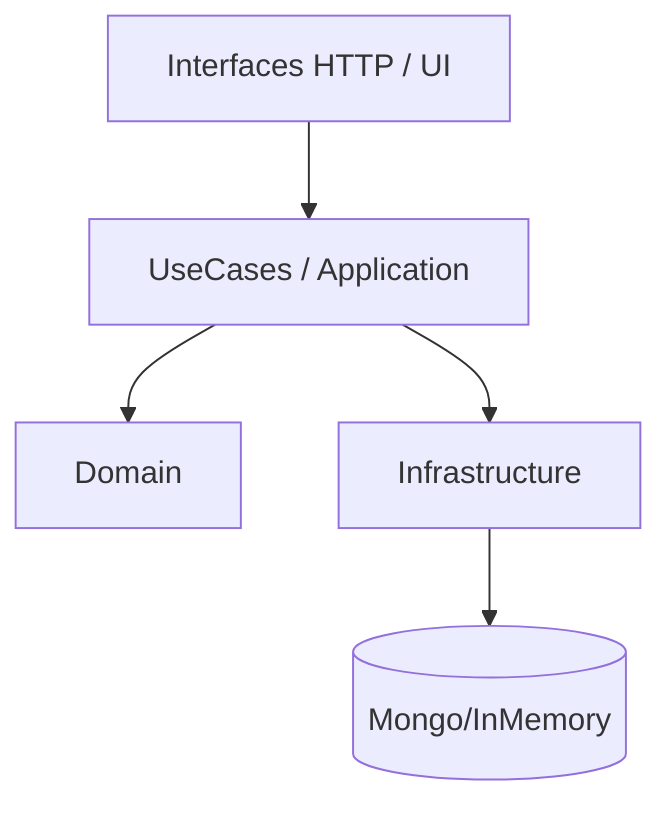
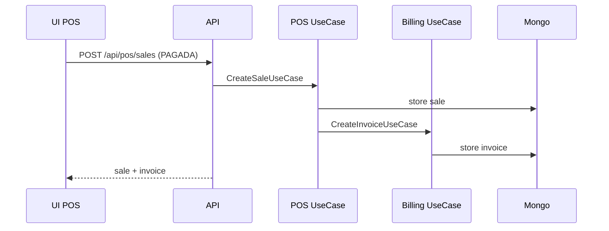
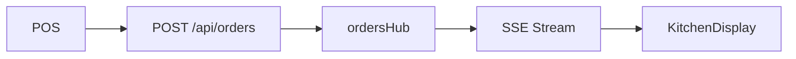

# Arquitectura

Fecha: 2026-03-08

## Principios
- Clean Architecture: domain -> application -> infrastructure -> interfaces.
- Multi-tenant: tenantId obligatorio en cada consulta y comando.
- White-label: branding via CSS variables y configuracion por tenant.

## Backend (Node + Express)
- Domain: entidades y reglas (Tenants, Billing, POS, CRM, etc).
- Application: casos de uso y servicios (CreateInvoiceUseCase, TaxCalculatorService).
- Infrastructure: Mongo, InMemory, SSE hubs, terceros.
- Interfaces: rutas HTTP y middlewares.

## Frontend (React)
- shared: layouts, contextos, UI base, infraestructura HTTP.
- modules: features por rol y vertical (admin, staff, landing, hosteleria).

## Flujos clave
- Auth -> JWT -> tenantId en req.auth.
- VerticalRegistry -> rutas dinamicas de landing + temas.
- POS -> venta -> billing (invoice) si status PAGADA.
- Orders -> SSE -> KitchenDisplay.

## Diagramas

### Capas Clean Architecture

### Flujo POS -> Billing

### Orders SSE

