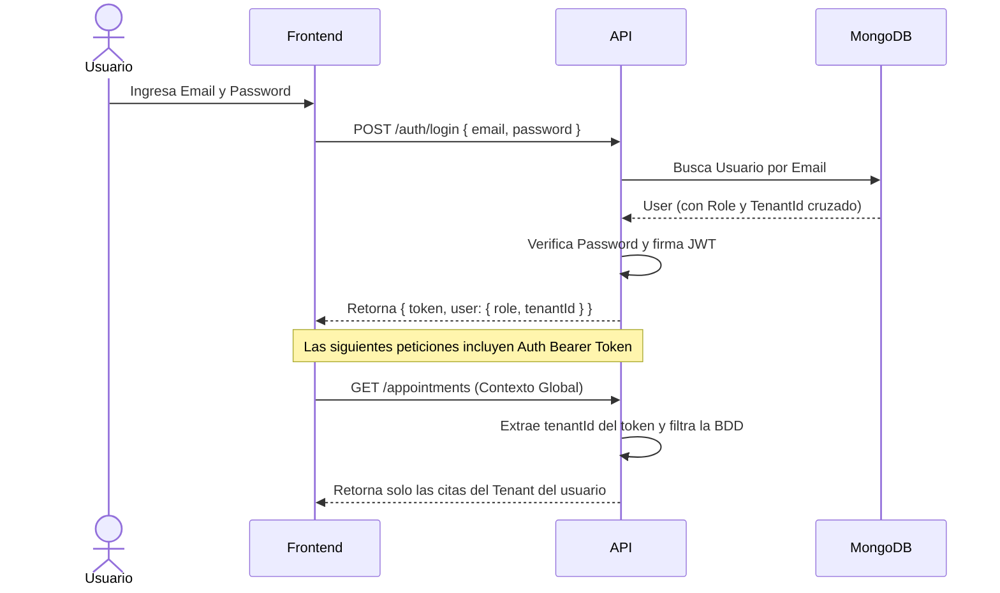
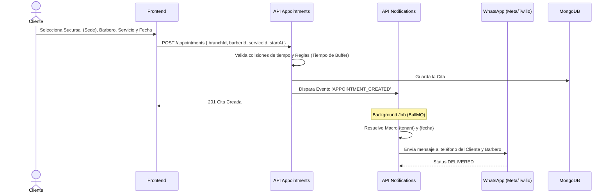
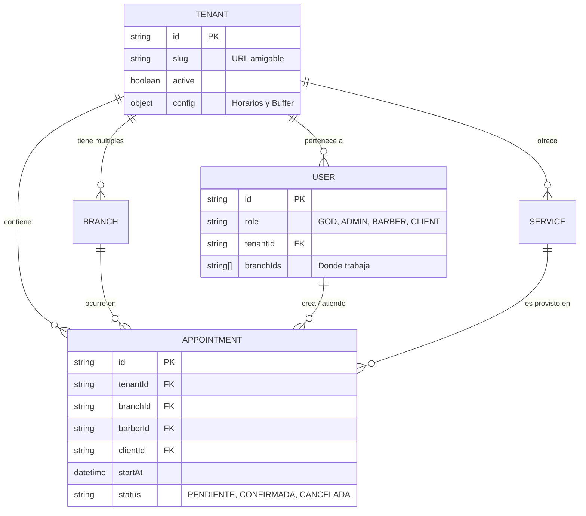

# Arquitectura del Sistema: BarberSync SaaS

Este documento describe la arquitectura técnica, los componentes clave y los flujos de datos principales del ecosistema `BarberSync`.

## Topología General

El sistema opera bajo un entorno de despliegue monolítico modular dividido en Frontend y Backend, diseñado nativamente como un sistema **Multi-Tenant** (SaaS).

- **Frontend:** React, TypeScript, Vite, React Router, Tailwind CSS. Consumido por clientes, barberos, administradores y Super Admin (GOD).
- **Backend:** Node.js, Express, TypeScript, Mongoose (MongoDB). Responsable de la API REST y la regla de negocio.
- **Workers/Background:** BullMQ con Redis, procesando encolamiento de notificaciones por WhatsApp.

---

## 1. Flujo de Autenticación y Multi-Tenancy

Cada petición al sistema determina a qué negocio (Tenant) pertenece la acción.

---

## 2. Flujo de Agendamiento de Citas (Cliente)

Describe cómo un cliente reserva una cita en una Sede (Sucursal) específica.

---

## 3. Entidades Core (Diagrama de Dominio Físico)

