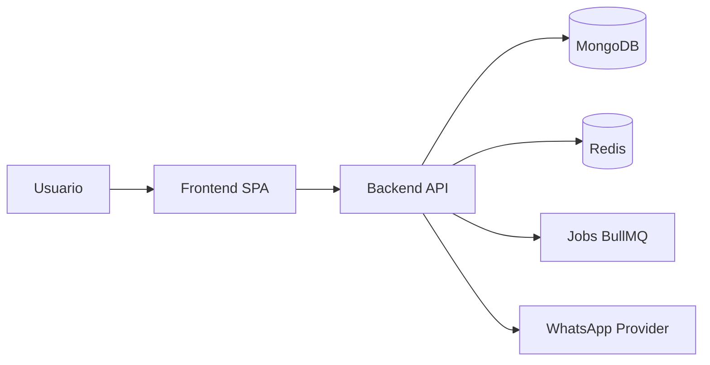
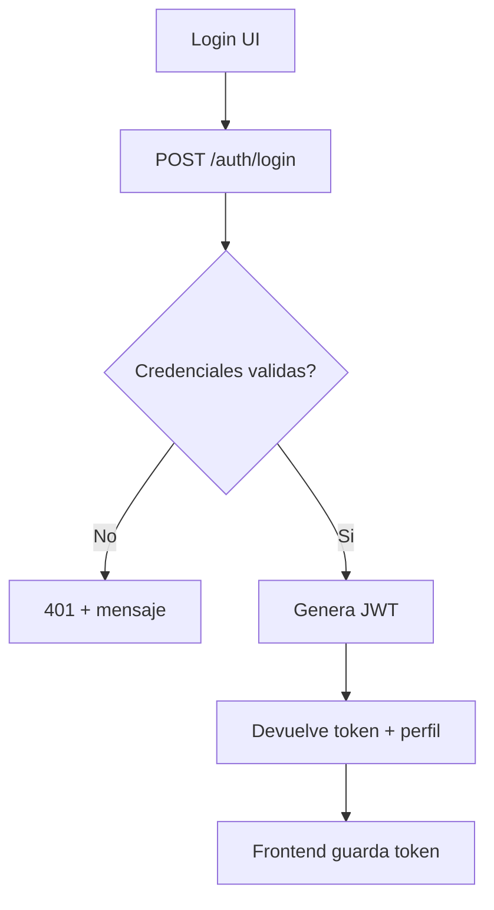
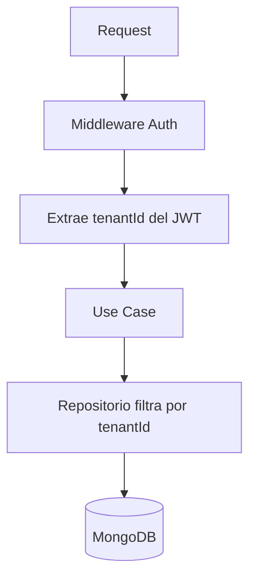
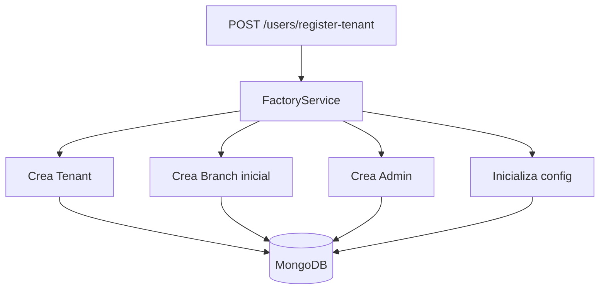
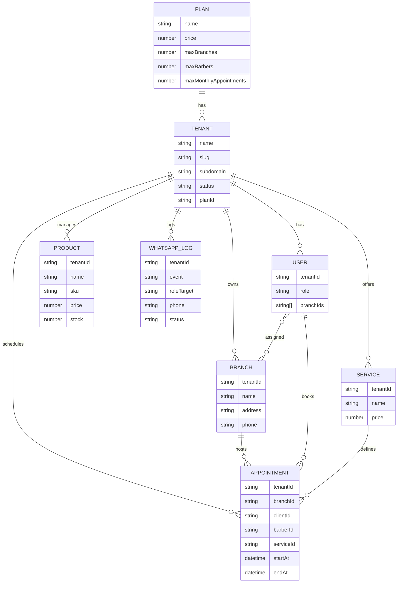
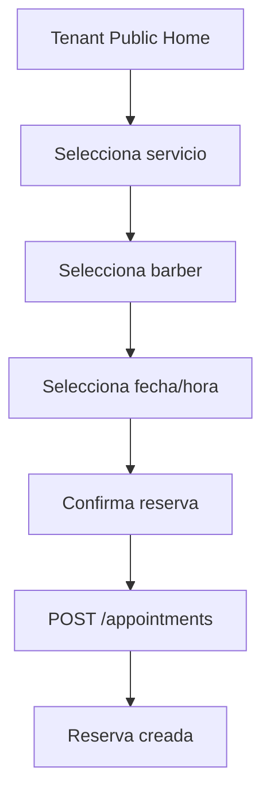
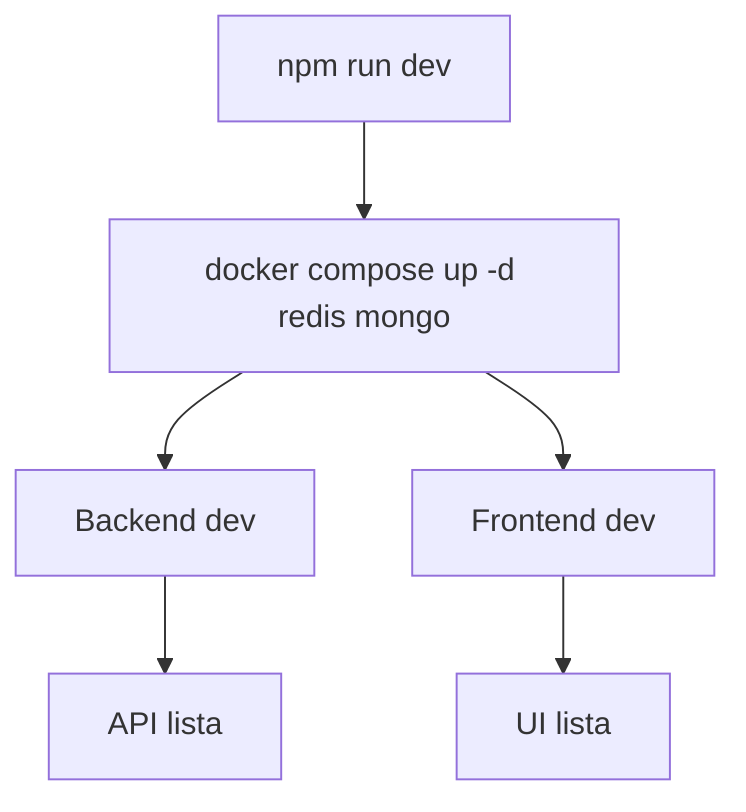
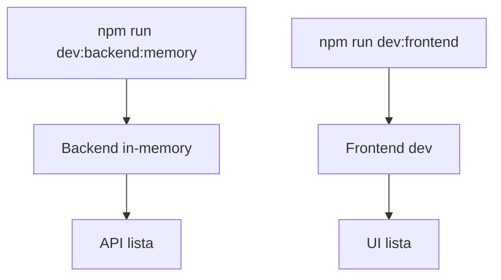

# ESSENCE FACTORY SAAS - Documentacion Tecnica para Desarrollo

Fecha: 2026-03-05

## 0. Documentacion extendida
- docs/INDEX.md
- docs/ARCHITECTURE.md
- docs/FEATURES.md
- docs/VERTICALS.md
- docs/REALTIME.md
- docs/BILLING.md
- docs/CONTENT.md
- docs/DEPLOYMENT.md

## 1. Resumen Ejecutivo
Essence Factory SaaS es una plataforma multi-tenant white-label para verticales de servicios. El sistema opera como monorepo con frontend React (SPA) y backend Node/Express, con persistencia en MongoDB y jobs opcionales via Redis/BullMQ. La plataforma ofrece onboarding automatico de negocios, control por planes, branding por tenant y modulos de operacion (agenda, staff, inventario, reportes, WhatsApp).

## 2. Como empezar (dev)

### 2.1 Requisitos
- Node.js >= 18
- Docker Desktop (para Mongo/Redis)
- Git

### 2.2 Configuracion rapida
1) Copia el archivo de entorno:
	- `cp .env.example .env`
2) Define un `JWT_SECRET` seguro (64 bytes hex).
3) Instala dependencias:
	- `npm install`
4) Ejecuta el entorno de desarrollo:
	- `npm run dev`

### 2.3 Alternativa sin Docker
Si no puedes usar Docker, ejecuta:
- `npm run dev:backend:memory`
- `npm run dev:frontend`

### 2.4 Puertos por defecto
- Frontend: http://localhost:5174
- Backend API: http://localhost:4000
- MongoDB: 27017
- Redis: 6379
- Mongo Express: http://localhost:8081

### 2.5 Troubleshooting rapido
- Error `JWT_SECRET es obligatorio`: crea `.env` en la raiz y define `JWT_SECRET`.
- Error Docker pipe (Windows): inicia Docker Desktop.
- Orphan containers: `docker compose up -d --remove-orphans`.

## 3. Arquitectura General

### 3.1 Topologia
- Frontend SPA: React 19 + Vite 6 + Tailwind 4 + React Router 7.
- Backend API REST: Node.js + Express + TypeScript.
- Persistencia: MongoDB (principal) con repositorios in-memory para fallback.
- Jobs: Redis + BullMQ (opcional, controlado por ENABLE_JOBS).
- Hosting: Nginx (en Docker), configuracion local con Vite.

### 3.2 Multi-Tenancy
- `tenantId` viaja en JWT y condiciona consultas.
- Repositorios filtran por `tenantId` en la capa de persistence.
- Frontend resuelve tenant por subdominio y aplica branding con CSS variables.

### 3.3 Capas de Aplicacion
Backend sigue arquitectura hexagonal:
- domain: entidades, reglas y validaciones core.
- application: casos de uso.
- infrastructure: adaptadores (Mongo, Redis, JWT, etc).
- interfaces: rutas HTTP y controladores.

Frontend sigue separacion por modulos:
- shared: contextos, layouts, infraestructura y UI base.
- modules: features por rol (admin, staff, god, landing, onboarding).

### 3.4 Diagramas (arquitectura y flujos)

#### 3.4.1 Flujo general (frontend + backend + datos)


#### 3.4.2 Flujo de autenticacion


#### 3.4.3 Flujo multi-tenant (request)


#### 3.4.4 Provisioning de tenant


## 4. Rutas y Hosts

### 4.1 Namespace por host
- domain.com/ -> Landing principal (corporativa, venta del producto).
- domain.com/barberias-landing -> Landing vertical barberias (marketing + planes + login).
- subdominio.domain.com/ -> Software real del cliente (tenant).

### 4.2 Router por contexto
- landing: rutas publicas de marketing y vertical.
- app: rutas internas para roles y paneles.
- tenant: ruta de booking para clientes finales.

## 5. Roles y Jerarquia
- GOD: control global (tenants, planes, metricas, panel GOD).
- ADMIN: operacion del tenant (agenda, staff, inventario, reportes, sedes).
- BARBER: operacion diaria (staff dashboard).
- CLIENT: reserva y acceso al booking.

## 6. Backend

### 6.1 Stack
- Node.js >= 18
- Express 4
- TypeScript
- MongoDB + Mongoose
- Redis + BullMQ (opcional)
- JWT + bcrypt

### 6.2 Modulos
- auth: login, tokens, reset de password.
- users: CRUD de usuarios, registro de cliente, registro de tenant.
- tenants: data del negocio, branding, metrics.
- plans: planes globales y limites.
- branches: sedes por tenant.
- services: catalogo de servicios.
- barbers: horarios y bloqueos.
- appointments: reservas, cambios y reglas de colision.
- notifications: WhatsApp, logs y configuracion.
- reports: resumen diario, rango y comisiones.
- inventory: productos, ventas, reabastecimiento.

### 6.3 Entidades principales
- Plan: name, price, maxBranches, maxBarbers, maxMonthlyAppointments, features.
- Tenant: name, slug, subdomain, planId, status, customColors, logoUrl, config.
- Branch: tenantId, name, address, phone, active.
- User: role, tenantId, branchIds, approved, whatsappConsent, commissionRate.
- Appointment: tenantId, branchId, clientId, barberId, serviceId, startAt, endAt, status.
- Product: tenantId, name, sku, price, stock, costos y restocks.
- WhatsAppLog: tenantId, event, roleTarget, phone, status.

### 6.4 Relaciones de Base de Datos
- Plan 1..n Tenant (Tenant.planId).
- Tenant 1..n Branch (Branch.tenantId).
- Tenant 1..n User (User.tenantId).
- Tenant 1..n Service (Service.tenantId).
- Tenant 1..n Product (Product.tenantId).
- Tenant 1..n Appointment (Appointment.tenantId).
- Tenant 1..n WhatsAppLog (WhatsAppLog.tenantId).
- Branch 1..n Appointment (Appointment.branchId).
- User (BARBER) 1..n Appointment (Appointment.barberId).
- User (CLIENT) 1..n Appointment (Appointment.clientId).
- Service 1..n Appointment (Appointment.serviceId).
- User n..n Branch (User.branchIds).

### 6.4.1 Diagrama de entidades (ER)


### 6.5 Provisioning (FactoryService)
Registro tenant:
1) Crea Tenant con plan Trial por defecto.
2) Crea Branch inicial.
3) Crea Admin asociado.
4) Inicializa config de agenda y notificaciones.

### 6.6 Gatekeeper de Planes
Middleware para controlar limites por plan:
- Antes de crear BARBER -> valida maxBarbers.
- Antes de crear BRANCH -> valida maxBranches.

### 6.7 No-shows
- Regla: bloqueo o pago previo despues de N faltas.
- Respuesta 402 con `paymentUrl` para desbloqueo.

### 6.8 Redis y Jobs
- ENABLE_JOBS controla ejecucion de jobs.
- Redis en 6379 por default.
- En dev, si Redis no esta activo, logs pueden aparecer pero no bloquean el API.

## 7. Frontend

### 7.1 Stack
- React 19
- TypeScript
- Vite 6
- Tailwind 4
- React Router 7
- TanStack Query
- Recharts
- React Day Picker

### 7.2 White-Label
- TenantContext resuelve el subdominio.
- Inyecta CSS variables: --primary, --secondary, --logo-url.
- Branding dinamico en layouts y componentes base.

### 7.3 Rutas Principales
Landing:
- / -> landing corporativa.
- /barberias-landing -> vertical barberias.
- /barberias-login -> login duenos y staff.
- /barberias-client-login -> login clientes (con subdominio).
- /admin-login -> login exclusivo GOD.

App:
- /admin
- /admin/agenda
- /admin/team (comisiones)
- /admin/branches
- /admin/whatsapp
- /admin/inventory
- /admin/reports
- /staff
- /god

Tenant:
- / -> booking engine

### 7.4 Login y Roles
- LoginCard valida roles permitidos segun portal.
- GOD solo entra via /admin-login.
- Duenos y staff via /barberias-login.
- Clientes via /barberias-client-login + subdominio.

### 7.5 PWA
- Vite PWA con manifest e iconos personalizados.
- Registro de SW en prod con wrapper para dev.

### 7.6 Flujos UI clave

#### 7.6.1 Login por portal y rol
```mermaid
flowchart TD
	A[Selecciona portal] --> B{Portal}
	B -- Admin/GOD --> C[/admin-login]
	B -- Duenos/Staff --> D[/barberias-login]
	B -- Clientes --> E[/barberias-client-login]
	C --> F[LoginCard valida roles]
	D --> F
	E --> F
	F --> G[AppLayout]
```

#### 7.6.2 Booking publico


## 8. API REST (Resumen)

### Auth
- POST /auth/login
- GET /auth/me
- POST /auth/password/forgot
- POST /auth/password/reset

### Users
- GET /users (ADMIN)
- POST /users/register
- POST /users/register-tenant
- POST /users/admin (ADMIN)
- GET /users/pending (GOD)
- PATCH /users/:id
- PATCH /users/:id/whatsapp-consent
- PATCH /users/me
- GET /users/public/barbers

### Tenants (GOD)
- GET /tenants
- GET /tenants/metrics
- GET /tenants/usage/whatsapp
- GET /tenants/slug/:slug
- GET /tenants/:id

### Plans (GOD)
- GET /plans
- PATCH /plans/:id

### Branches
- GET /branches (ADMIN)
- POST /branches (ADMIN)

### Services
- GET /services
- POST /services (ADMIN)
- PATCH /services/:id (ADMIN)

### Barbers
- GET /barbers/:barberId/schedules
- POST /barbers/:barberId/schedules
- GET /barbers/:barberId/blocks
- POST /barbers/:barberId/blocks

### Appointments
- GET /appointments
- POST /appointments
- PATCH /appointments/:id/status
- POST /appointments/:id/cancel
- POST /appointments/:id/reschedule
- POST /appointments/:id/reassign
- GET /appointments/:id/history

### Notifications
- GET /notifications/logs
- GET /notifications/config
- PATCH /notifications/config

### Reports
- GET /reports/summary
- GET /reports/daily
- GET /reports/range

### Inventory
- GET /inventory
- POST /inventory
- PATCH /inventory/:id
- DELETE /inventory/:id
- POST /inventory/sales
- POST /inventory/restock

## 9. Variables de Entorno

### 9.1 Backend
- NODE_ENV, PORT
- MONGODB_URI, USE_MONGO
- REDIS_URL, ENABLE_JOBS
- JWT_SECRET, JWT_EXPIRES_IN
- MIN_ADVANCE_MINUTES, CANCEL_LIMIT_MINUTES, RESCHEDULE_LIMIT_MINUTES
- QUIET_HOURS_START, QUIET_HOURS_END
- CORS_ORIGINS
- CLOUDINARY_*
- VAPID_*

### 9.2 Frontend
- VITE_API_BASE_URL

## 10. Build y Dev

### 10.1 Comandos
- npm run dev (monorepo)
- npm run dev -w backend
- npm run dev -w frontend
- npm run build

### 10.2 Notas de Dev
- Vite usa polling en Windows para detectar cambios.
- Backend usa ts-node-dev con polling.
- Redis puede ser opcional en dev.

### 10.3 Flujos operativos (dev)

#### 10.3.1 Boot de entorno (Docker)


#### 10.3.2 Boot sin Docker


## 11. Seguridad
- JWT con expiracion configurada.
- bcrypt para hashing de password.
- CORS configurado por env.
- Rate limiting activo.

## 12. Observabilidad
- pino-http para logs.
- Swagger base habilitado en /docs.

## 13. Roadmap Tecnico
- Landing SEO por vertical con metadatos dinamicos.
- Dashboard GOD con graficas y uso por ciudad.
- Multi-vertical extensible (restaurantes, gimnasios).
