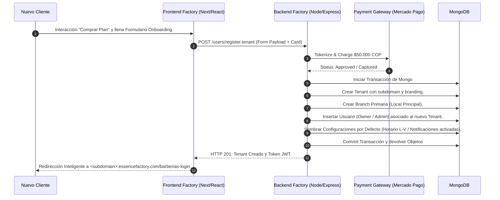
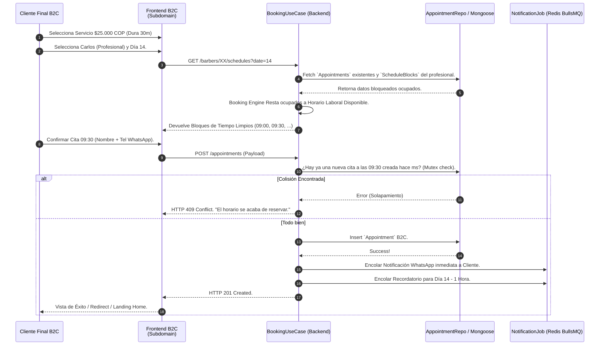

# Diagramas de Flujo y Procesos Core - ESSENCE Factory

Este documento amplía la visualización de datos exponiendo, paso a paso, el flujo de operaciones transaccionales críticas a lo largo del sistema y los responsables de cada decisión/actividad.

---

## 1. Onboarding Automático y Generación de Marca (B2B)
El flujo más importante del sistema comercial: cómo un cliente de internet paga y automáticamente se despliega su subdominio completo (Ej. peluqueriaxtrema.essence.com).



---

## 2. Proceso de Agendamiento B2C Inteligente (Filtrado y Colisión)
Exposición de las validaciones a través del backend para impedir dobles reservas.



---

## 3. Dunning Period y Suspensión Forzosa (Gestión Financiera Factory)
Si el software funciona perfecto pero el cliente rebota la tarjeta finalizado el mes:

```mermaid
flowchart TD
    Inicio((Cron Job: Chequeo Diario Dunning)) --> TraerTenants[Obtener Tenants Vencidos del Mes]
    TraerTenants --> Filtrar[Filtrar por Status == ACTIVE]
    
    Filtrar --> A{¿Intento de cobro en MP Exitoso?}
    
    A -- SI --> B[Renovar Fecha de Expiración]
    B --> Fin((Fin normal))
    
    A -- NO --> C{Cuenta Días Impagos (Failed Payments)}
    
    C -- Días == 1 --> D1[Enviar Email Recordatorio 1 (Tranquilo)] --> Fin
    C -- Días == 3 --> D2[Enviar Email Recordatorio 2 (Urgente)] --> Fin
    
    C -- Días >= 5 --> Bloqueo[Sistema: Action Suspend Tenant]
    Bloqueo --> DBChange[(MongoDB: Actualizar STATUS a SUSPENDED)]
    DBChange --> BlockFrontend(Inyectar bandera. Frontend B2C y B2B bloqueado para Operaciones / Mostrar 'Factura Pendiente')
    BlockFrontend --> Fin((Tenant Pausado Legalmente))
```
