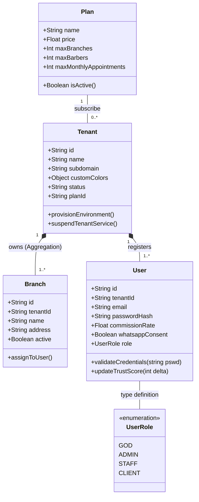
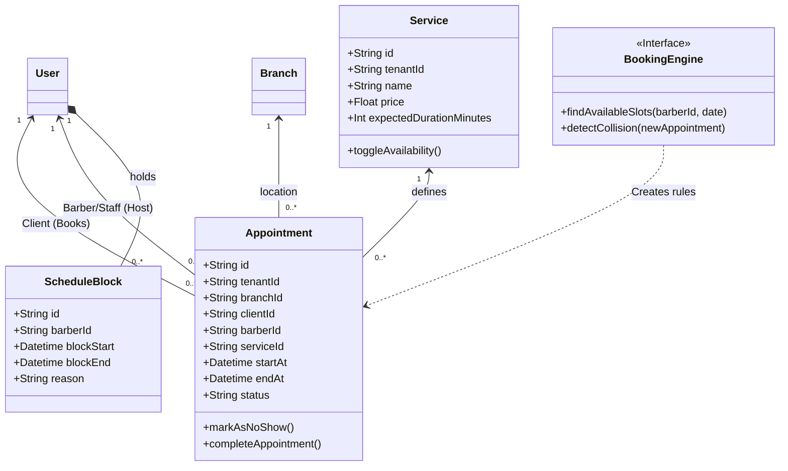

# Diagramas UML de Clases - ESSENCE Factory

Requerimiento: Este documento avanza las definiciones puras Entity-Relational, brindando Diagramas de Clase OOD (Orientados a Objetos) basados en Mermaid para exponer el Domain Driven Design (DDD) implementado en TypeScript (Backend Clean Architecture).

---

## 1. Domain Object Model (Core Multi-Tenant)
La interconexión arquitectónica que muestra la visibilidad y responsabilidades técnicas inyectadas vía constructor (Casos de uso / Clases).

---

## 2. Diagrama de Módulo Citas (Booking Engine)

Este esquema relacional expone las dependencias y servicios involucrados para que un usuario reserve tiempo contra las entidades horarias de la clínica/salón (Tenant).

## 3. Comentarios Backend (Clean Architecture / TypeScript Classes)
Esta vista conceptualiza que las clases `User` o `Appointment` de Domain no extienden de Clases `Mongoose Document`. Las implementaciones de repositorios (e.g. `MongoUserRepository implements IUserRepository`) realizan la traducción OOD -> ORM (Dapper/Mongoose) impidiendo el acoplamiento.
